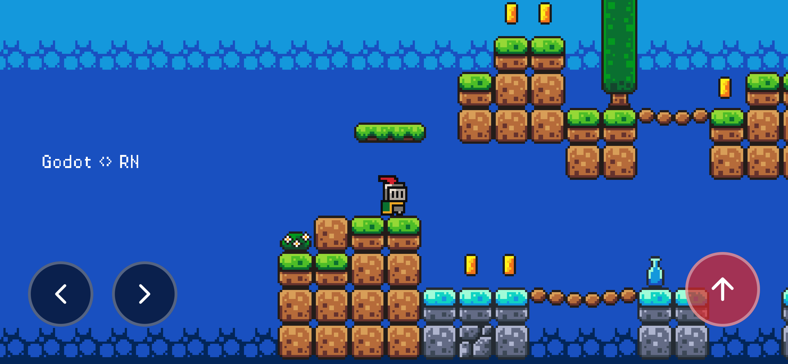
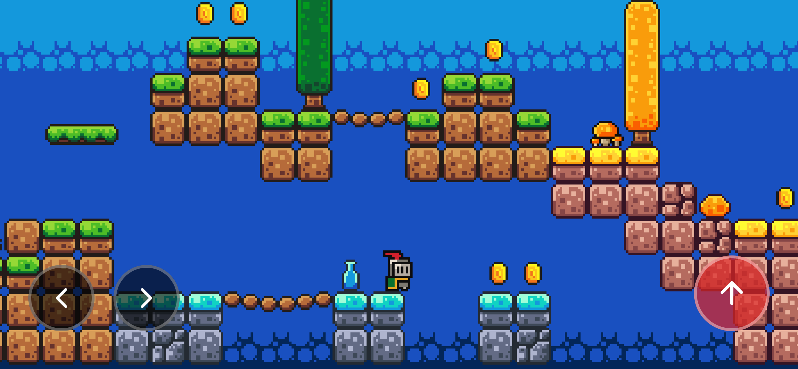
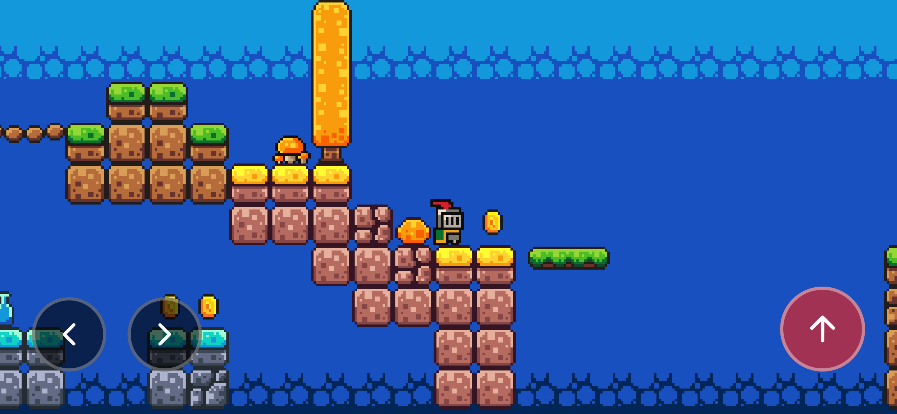

# React Native Godot + Expo Demo

A demonstration project showing how to integrate [React Native Godot](https://github.com/borndotcom/react-native-godot) by `borndotcom` with [Expo](https://expo.dev). This project showcases embedding the Godot Engine into an Expo React Native application with custom touch controls and game interaction.

## 🎮 What is this?

This project demonstrates:
- **Godot Engine Integration**: Running Godot games within an Expo app
- **Cross-Platform Support**: Works on both iOS and Android
- **Custom Controls**: Touch-based game controls overlaid on the Godot view
- **Godot API Access**: Direct interaction with Godot's Input system from React Native
- **Custom Expo Plugin**: Automatic handling of Godot files for both iOS and Android builds

## 📸 Screenshots
  
  
  
  


## 🚀 Getting Started

### 1. Clone the Repository

```bash
git clone https://github.com/akshayjadhav4/react-native-godot-demo.git
cd react-native-godot-demo
```

### 2. Install Dependencies

```bash
pnpm install
```

This will automatically:
- Download LibGodot prebuilt libraries
- Apply the Android patch (see [Android Patch Note](#android-patch-note) below)
- Build the custom Expo config plugin

### 3. Download LibGodot Prebuilt Libraries (Optional)

**Note**: This step is automatically executed during `pnpm install` (step 2). You only need to run this manually if you want to update or re-download the libraries.

```bash
pnpm run download-prebuilt
```

This downloads the prebuilt LibGodot packages required by React Native Godot. This way React Native Godot can be updated independently from LibGodot, and also local, customized builds of LibGodot are supported.

### 4. Configure Android Build Properties (Required for Android)

This project uses `expo-build-properties` to configure Android-specific settings. The configuration is already set up in `app.json`, but ensure it includes:

```json
[
  "expo-build-properties",
  {
    "android": {
      "minSdkVersion": 29,
      "extraMavenRepos": [
        "../../node_modules/@borndotcom/react-native-godot/android/libs/libgodot-android/4.5.1.migeran.2"
      ]
    }
  }
]
```

This configuration:
- Sets the minimum Android SDK version to 29
- Adds the LibGodot Maven repository path for Android builds

**Note**: This is already configured in the project's `app.json` file.

### 5. Add Your Godot Game (Optional)

#### For iOS:
Place your exported Godot game file at:

```
assets/godot/main.pck
```

#### For Android:
Place your exported Godot game files as a folder structure at:

```
assets/godot/godot-files/main/
```

**Why different formats?**
- **iOS**: Uses a `.pck` (pack) file because there's no performance limitation when accessing pack files from the app bundle. The pack file is more efficient and easier to manage.
- **Android**: Requires files as a folder structure because accessing pack file contents from the main package is much slower on Android. Storing files as individual files in the asset folder provides better performance.

**Note**: The included files are for a sample platformer game. Replace them with your own Godot game export.

### 6. Run on iOS

```bash
npx expo prebuild --platform ios --clean
pnpm ios
```

The custom Expo plugin will automatically copy the `main.pck` file to the iOS project and add it to Xcode resources.

### 7. Run on Android

```bash
npx expo prebuild --platform android --clean
pnpm android
```

The custom Expo plugin will automatically copy the Godot files from `assets/godot/godot-files/main/` to `android/app/src/main/assets/main/` during the prebuild process.

#### Android Patch Note

This project includes a patch for `@borndotcom/react-native-godot@1.0.1` located in `patches/@borndotcom__react-native-godot.patch`. The patch fixes Android crashes that occur when using Expo with the new React Native architecture (Arc). 

The patch ensures proper JNI initialization by setting the JavaVM pointer in LibGodot before initialization, which is critical for Android thread creation. The patch is automatically applied during `pnpm install` via `patch-package`.

If you encounter crashes on Android, ensure the patch is applied by running:
```bash
pnpm install
```


## 📁 Project Structure

```
godot-app/
├── app/                      # Main application screens
│   ├── index.tsx            # Home screen with Godot integration
│   └── _layout.tsx          # Navigation layout
├── assets/
│   └── godot/
│       ├── main.pck         # Godot game package file (iOS)
│       └── godot-files/     # Godot game files folder (Android)
│           └── main/        # Unpacked game files for Android
├── patches/                  # Patch files for dependencies
│   └── @borndotcom__react-native-godot.patch  # Android crash fix patch
├── plugin/                   # Custom Expo config plugin
│   └── src/
│       ├── index.ts         # Plugin entry point
│       ├── withPckFile.ts   # iOS .pck file integration
│       └── withGodotFiles.ts # Android files integration
├── app.plugin.js            # Plugin configuration
└── app.json                 # Expo configuration
```

## 🎯 Key Features

### Custom Game Controls

The demo includes touch controls that interact with the Godot game:

- **Left Arrow**: Move left (`ui_left` action)
- **Right Arrow**: Move right (`ui_right` action)
- **Jump Button**: Jump (`ui_accept` action)

These controls use Godot's Input API through worklets for thread-safe communication.

### Custom Expo Config Plugin

The project includes custom Expo plugins that handle platform-specific Godot file integration:

**iOS Plugin** (`plugin/src/withPckFile.ts`):
- Automatically copies `main.pck` from `assets/godot/` to the iOS project root
- Adds the file to Xcode project resources
- Ensures proper build configuration for iOS

**Android Plugin** (`plugin/src/withGodotFiles.ts`):
- Automatically copies Godot files from `assets/godot/godot-files/main/` to `android/app/src/main/assets/main/`
- Recursively copies all files and subdirectories
- Ensures the assets directory exists before copying
- Runs during the `expo prebuild` process

Both plugins are configured in `app.plugin.js` and run automatically when you execute `npx expo prebuild`.

## 🔧 Configuration

### App Configuration (`app.json`)

Key settings:
- **Orientation**: Set to `landscape` for game display
- **Custom Plugin**: Configured to handle Godot assets for both iOS and Android
- **Android Build Properties**: Configured with `expo-build-properties` plugin:
  ```json
  [
    "expo-build-properties",
    {
      "android": {
        "minSdkVersion": 29,
        "extraMavenRepos": [
          "../../node_modules/@borndotcom/react-native-godot/android/libs/libgodot-android/4.5.1.migeran.2"
        ]
      }
    }
  ]
  ```
  This ensures the LibGodot Android library is accessible during the build process.

## 🎮 How It Works

### 1. Godot Thread Execution

All Godot operations run on a dedicated thread using worklets:

```typescript
runOnGodotThread(() => {
  'worklet';
  const Godot = RTNGodot.API();
  // Godot operations here
});
```

### 2. Input Handling

The app demonstrates sending input events to Godot:

```typescript
function pressAction(action: string) {
  runOnGodotThread(() => {
    'worklet';
    const Godot = RTNGodot.API();
    const Input = Godot.Input;
    Input.action_press(action);
  });
}
```

### 3. View Integration

The Godot view is embedded as a React Native component:

```typescript
<RTNGodotView style={styles.gameView} />
```

## 📱 Platform-Specific Notes

### iOS
- Game file is bundled as `main.pck` in the app bundle
- Custom Expo plugin (`withPckFile.ts`) handles Xcode project integration
- File accessed via `FileSystem.bundleDirectory + "main.pck"`
- Godot instance initialized with `--main-pack` parameter pointing to the `.pck` file

### Android
- Game files are stored as individual files in `android/app/src/main/assets/main/`
- Custom Expo plugin (`withGodotFiles.ts`) automatically copies files from `assets/godot/godot-files/main/` during prebuild
- Files must be in folder structure (not `.pck`) because accessing pack file contents from the main package is much slower on Android
- Godot instance initialized with `--path /main` parameter pointing to the assets directory
- The plugin recursively copies all files and subdirectories to ensure the complete game structure is available
- **Patch Required**: A patch is applied to `@borndotcom/react-native-godot@1.0.1` to fix crashes on Android Expo (likely due to new React Native architecture). The patch is in `patches/@borndotcom__react-native-godot.patch` and is automatically applied during installation
- **Build Configuration**: Requires `expo-build-properties` plugin with `minSdkVersion: 29` and LibGodot Maven repository path configured (see [Configuration](#-configuration) section)

## 📚 Resources

### Make simple game with Godot
- [Godot Beginner Tutorial](https://youtu.be/LOhfqjmasi0?si=EGMVRKSGOUvXUVnJ)

### React Native Godot
- [GitHub Repository](https://github.com/borndotcom/react-native-godot)

## 🎨 Game Assets & Credits

The demo platformer game included in this project uses assets from the Brackeys Godot tutorial. All assets have been repackaged and many have been modified by Brackeys.

### License

**Creative Commons Zero (CC0)** - Free to use for any purpose

### Credits

**Sprites by analogStudios_:**
- Knight - [Camelot Pack](https://analogstudios.itch.io/camelot)
- Slime - [Dungeon Sprites](https://analogstudios.itch.io/dungeonsprites)
- Platforms and Coin - [Four Seasons Platformer Sprites](https://analogstudios.itch.io/four-seasons-platformer-sprites)

**Sprites by RottingPixels:**
- World Tileset and Fruit - [Four Seasons Platformer Tileset](https://rottingpixels.itch.io/four-seasons-platformer-tileset-16x16free)

**Sounds:**
- Brackeys, Asbjørn Thirslund

**Music:**
- Brackeys, Sofia Thirslund

**Fonts by Jayvee Enaguas (HarvettFox96):**
- [Pixel Operator](https://www.dafont.com/pixel-operator.font?l[]=10&l[]=1)

---

Built with ❤️ using [React Native Godot](https://github.com/borndotcom/react-native-godot) and [Expo](https://expo.dev)
