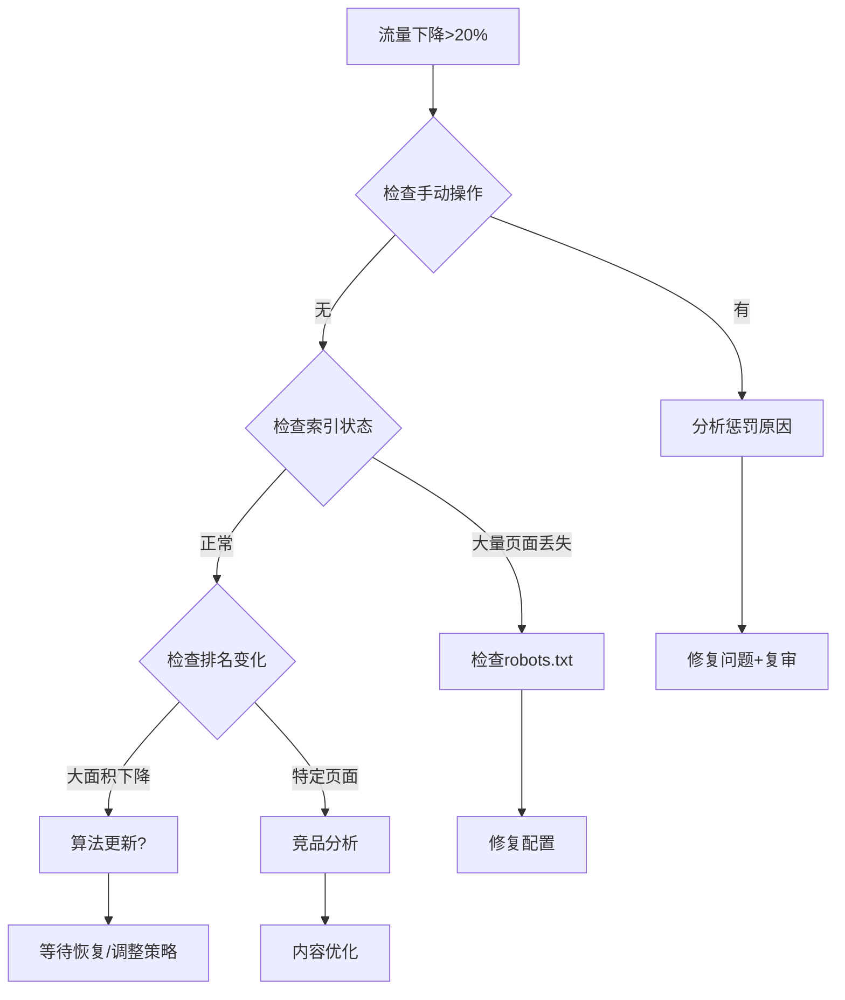

# GSC监控SOP

> Google Search Console是SEO监控的核心工具，系统化的监控确保问题早发现、早解决。

## 📋 GSC监控概览

### 监控频率

| 监控项 | 频率 | 负责人 | 耗时 |
|-------|-----|-------|------|
| 性能概览 | 每日 | SEO | 5分钟 |
| 索引状态 | 每周 | SEO | 15分钟 |
| 覆盖率报告 | 每周 | SEO/Dev | 20分钟 |
| Core Web Vitals | 每周 | Dev | 15分钟 |
| 手动操作 | 每周 | SEO | 5分钟 |
| 深度分析 | 每月 | SEO | 1小时 |

---

## 📊 日常监控检查清单

### 每日快速检查 (5分钟)

```markdown
性能仪表板:
- [ ] 总点击量是否正常（对比前7天均值）
- [ ] 总展示量是否正常
- [ ] 是否有异常大幅波动（>20%）
- [ ] 平均排名是否稳定

警报阈值:
- 点击量下降 >20% → 立即调查
- 展示量下降 >30% → 检查索引
- 平均排名上升 >5位 → 分析原因
```

### 每周深度检查 (1小时)

#### 1. 索引覆盖率

```markdown
检查项:
- [ ] 有效页面数量
- [ ] 已排除页面原因
- [ ] 新增错误页面
- [ ] 新增警告页面

常见问题处理:
| 状态 | 可能原因 | 处理方法 |
|-----|---------|---------|
| 未找到(404) | 页面删除 | 设置301重定向 |
| 服务器错误(5xx) | 服务器问题 | 检查服务器日志 |
| 软404 | 内容太少 | 增加内容或noindex |
| 已抓取-未编入索引 | 质量问题 | 提升内容质量 |
| 已发现-未编入索引 | 抓取预算 | 优化内部链接 |
| 被robots.txt阻止 | 配置错误 | 检查robots.txt |
```

#### 2. 性能详细分析

```markdown
按页面分析:
- [ ] Top 10页面表现
- [ ] 流量下降页面（>30%）
- [ ] 新进入Top 100的页面

按查询分析:
- [ ] 主要关键词排名变化
- [ ] 新出现的查询
- [ ] 排名上升机会词（11-20位）

按国家/地区:
- [ ] 目标市场表现
- [ ] 新兴市场机会
```

#### 3. Core Web Vitals

```markdown
检查指标:
- [ ] LCP (Largest Contentful Paint)
  - 良好: <2.5s
  - 需改进: 2.5-4s
  - 差: >4s

- [ ] INP (Interaction to Next Paint)
  - 良好: <200ms
  - 需改进: 200-500ms
  - 差: >500ms

- [ ] CLS (Cumulative Layout Shift)
  - 良好: <0.1
  - 需改进: 0.1-0.25
  - 差: >0.25

不合格页面处理:
1. 导出问题URL列表
2. 按影响范围排序
3. 制定修复计划
4. 验证修复效果
```

#### 4. 手动操作和安全问题

```markdown
检查项:
- [ ] 无手动操作惩罚
- [ ] 无安全问题警告
- [ ] 无恶意软件检测

如发现问题:
1. 立即记录问题详情
2. 分析原因
3. 制定修复计划
4. 修复后提交复审
```

---

## 🔧 常用GSC操作

### URL检查工具使用

```markdown
用途:
- 检查单个URL索引状态
- 请求重新编入索引
- 查看渲染后的HTML
- 检查移动可用性

使用场景:
- 新页面发布后
- 页面更新后
- 排查索引问题
```

### Sitemap提交和监控

```markdown
Sitemap管理:
- 主Sitemap: /sitemap.xml
- 图片Sitemap: /image-sitemap.xml (如有)
- 新闻Sitemap: /news-sitemap.xml (如有)

监控项:
- 提交URL数
- 已编入索引URL数
- 索引率 (目标>90%)
- 错误和警告
```

### 删除工具使用

```markdown
适用场景:
- 紧急删除敏感内容
- 删除过时页面的搜索结果
- 批量删除某目录

注意:
- 删除是临时的（约6个月）
- 需要同时处理源页面
- 使用301重定向更持久
```

---

## 📈 月度GSC报告模板

```markdown
# GSC月度报告 - [YYYY-MM]

## 执行摘要
[1-2句话总结本月表现]

## 核心指标对比

| 指标 | 本月 | 上月 | 环比 | 同比 |
|-----|-----|-----|------|------|
| 总点击量 | | | % | % |
| 总展示量 | | | % | % |
| 平均CTR | | | | |
| 平均排名 | | | | |

## 索引状态

| 状态 | 本月 | 上月 | 变化 |
|-----|-----|-----|------|
| 有效页面 | | | |
| 已排除 | | | |
| 错误 | | | |
| 警告 | | | |

## Top 10 页面表现

| 排名 | 页面 | 点击量 | 展示量 | CTR | 排名 |
|-----|-----|-------|-------|-----|------|
| 1 | | | | | |
...

## Top 10 查询表现

| 排名 | 查询 | 点击量 | 展示量 | CTR | 排名 |
|-----|-----|-------|-------|-----|------|
| 1 | | | | | |
...

## 排名变化分析

### 排名上升 Top 5
| 查询 | 变化 | 当前排名 |
|-----|------|---------|

### 排名下降 Top 5
| 查询 | 变化 | 当前排名 | 原因分析 |
|-----|------|---------|---------|

## Core Web Vitals状态
- LCP: X% 良好
- INP: X% 良好  
- CLS: X% 良好

## 问题与行动项

| 问题 | 影响 | 优先级 | 行动 | 负责人 |
|-----|------|-------|------|-------|

## 下月目标
- [目标1]
- [目标2]
```

---

## ⚠️ 常见问题处理流程

### 流量突然下降



### 索引问题排查

```markdown
1. 页面未编入索引
   → 检查robots.txt
   → 检查noindex标签
   → 检查canonical标签
   → 检查内链是否充足
   → 检查页面质量

2. 页面从索引中消失
   → 检查页面是否可访问
   → 检查是否意外添加noindex
   → 检查服务器日志
   → 使用URL检查工具
```

---

## 🔗 相关文档

- [周报告模板](./weekly-report-template.md)
- [转化追踪设置](./conversion-tracking-setup.md)
- [技术SEO审计](../03-technical-seo/technical-seo-audit.md)

---

**文档版本**: v1.0  
**创建日期**: 2026-01-03  
**GSC账户**: [待配置]
